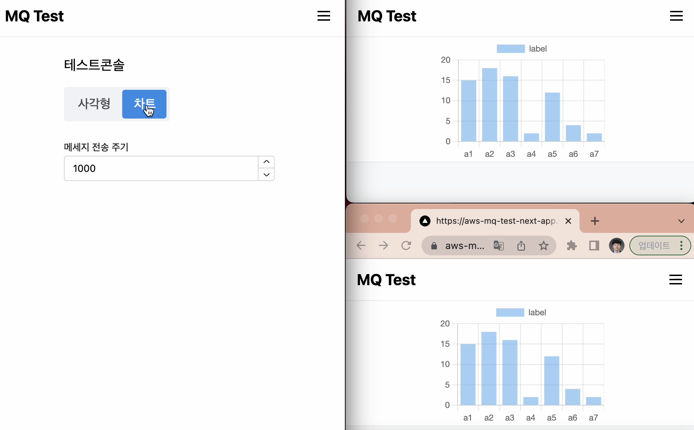
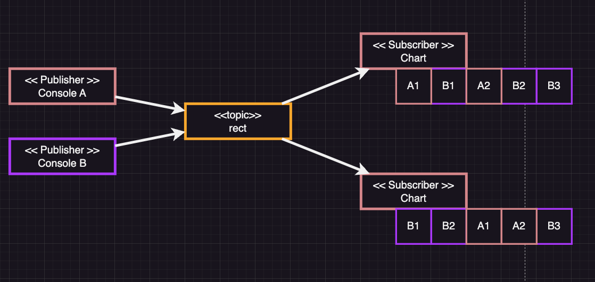
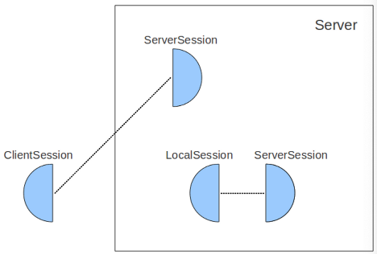

# Message Queue를 사용한 Pub/Sub모델 활용 예제

## 애플리케이션 구성

  

https://user-images.githubusercontent.com/41663269/228756570-e2ab0463-732f-439d-b0fa-a8f37b8891c4.mov

https://user-images.githubusercontent.com/41663269/228703885-1bed93db-a86d-453e-8bd7-330b97124383.mov  

  


- [애플리케이션 링크](https://aws-mq-test-next-app.vercel.app/console)
- `Console`페이지를 통해 메세지를 publish합니다.
- 사각형 회전 예제는 `rect`, 차트 예제는 `chart` `토픽`을 subscribe합니다.
- 해당하는 토픽에 메세지가 publish되면, 화면을 업데이트합니다.
- 메세지를 publish하고 subscribe하기 위해 websocket을 사용합니다.

## AWS MQ

### AWS MQ란

- AWS MQ는 Amazon Web Services에서 제공하는 메시지 큐 브로커 서비스입니다.
- AWS MQ는 RabbitMQ, ActiveMQ 등의 메시지 큐 엔진을 사용할 수 있습니다.
- AWS MQ는 다른 AWS 서비스와 통합되어 사용할 수 있습니다.
- AWS MQ는 메시지 큐를 사용하여 분산 시스템의 통합을 단순화 할 수 있습니다.
- AWS MQ는 AMQP, STOMP, MQTT 및 HTTPS 프로토콜을 지원합니다.

<br/>

## ActiveMQ

### ActiveMQ란

- ActiveMQ는 Apache Software Foundation에서 개발한 오픈 소스 메시지 브로커로, Java Message Service (JMS)를 구현합니다. - 메시지 브로커는 프로듀서(생산자)와 컨슈머(소비자) 사이에서 비동기 메시지 전달을 처리하는 중간 레이어로 작동합니다. 
- ActiveMQ에서는 주로 두 가지 메시지 전달 모델이 사용되는데, 그 중 하나는 토픽(Topic)입니다.

### Publish-Subscribe 모델

- 토픽은 Publish-Subscribe (Pub-Sub) 모델을 사용한 메시지 전달 방식입니다. 
- 이 모델에서 프로듀서는 메시지를 토픽에 발행하며, 컨슈머는 관심 있는 토픽을 구독합니다. 
- 토픽에 새 메시지가 발행되면, 구독 중인 모든 컨슈머에게 메시지가 전달됩니다.

### 토픽(Topic)

#### 토픽의 동작 방식

- 프로듀서는 메시지를 생성하고, 해당 메시지를 특정 토픽에 발행합니다.
- 컨슈머는 관심 있는 토픽을 구독하기 위해 ActiveMQ 브로커에 등록됩니다.
- 토픽에 새로운 메시지가 발행되면, ActiveMQ 브로커는 구독 중인 모든 컨슈머에게 해당 메시지를 전달합니다.
- 컨슈머는 전달된 메시지를 처리하고, 필요에 따라 응답 메시지를 발행할 수 있습니다.

#### 토픽의 구조

- 토픽은 주로 계층적인 이름 공간을 사용하여 구성됩니다. 
- 토픽 이름은 일반적으로 '.'(dot)으로 구분된 문자열로 표현되며, 이를 통해 관련된 토픽들을 그룹화할 수 있습니다. 
- 예를 들어, "finance.stock.market"이라는 토픽 이름은 금융, 주식, 시장 세 가지 계층으로 구성된 토픽을 나타냅니다.
ActiveMQ 토픽은 발행/구독 패턴을 사용하여 여러 구독자가 동시에 메시지를 수신할 수 있는 방식을 제공하며, 서로 다른 애플리케이션 및 서비스 간의 비동기식 통신을 지원합니다.

#### 토픽의 순서보장

- 같은 producer가 전송한 메시지의 순서는 보장되지만, 서로 다른 producer가 전송한 메시지의 순서는 보장되지 않습니다.  
    

- 이 경우 Total Ordering이라는 기능을 사용하여 순서를 보장할 수 있다고 합니다.  
단, 이 방법은 무거운 동기화 작업이 필요하여 성능이 저하된다고 합니다.
- 또는, 큐와 토픽을 함께 사용하여 순서를 보장하는 방법도 있다고 합니다.
- [참고링크](https://activemq.apache.org/total-ordering)

## Comet

---

**개요**

- 웹 환경에서 실시간 양방향 데이터 통신에 쓰이는 기술
- server push라고 표현한다(서버가 데이터를 클라이언트한테 push한다). 반대 표현은 client pull이다.

**연결 유형**

1. Long Polling: 클라이언트가 서버에 요청을 보내고, 서버는 새로운 데이터가 있을 때까지 응답을 보류합니다. 데이터가 준비되면 서버는 응답을 보내고, 클라이언트는 즉시 다음 요청을 보냅니다. 이 과정을 반복함으로써, 실시간 통신을 구현할 수 있습니다.
2. Server-Sent Events (SSE): 서버가 클라이언트에게 데이터를 보내는 단방향 통신 방식입니다. 클라이언트는 연결을 설정하고, 서버는 새로운 데이터가 있을 때마다 클라이언트에게 푸시합니다. SSE는 텍스트 데이터에 최적화되어 있고, 크로스 도메인 지원에 제한이 있습니다.
3. WebSocket: 양방향 통신을 지원하는 표준 웹 기술입니다. WebSocket은 서버와 클라이언트 간의 지속적인 연결을 통해 데이터를 실시간으로 전송할 수 있으며, 비교적 낮은 오버헤드로 효율적인 통신이 가능합니다.

**CometD와 comet**

- comet기술을 쉽게 구현할 수 있는 웹 메시징 프레임워크 중 하나이다.
- Bayeux 프로토콜을 사용하여 웹 메시징을 지원한다.

# CometD Concepts and Architecture

CometD 프로젝트는 다양한 Comet 기술을 제공하여, 확장가능한 웹 메시징 시스템을 제공한다.

HTTP나 WebSocket등의 프로토콜을 사용하여 통신한다.

[https://docs.cometd.org/current/reference/](https://docs.cometd.org/current/reference/)

# 정의

### Client

- 클라이언트는 연결을 시작하는(initiates) 개체이다.
- 보통 브라우저가 client의 역할을 맡지만, 다른 언어를 사용하는 애플리케이션도 얼마든지 
client가 될 수 있다.

### Server

- 연결을 수립하는(accepts) 개체이다.

### Connection

- 수립된 연결은 영속성을 가진다.
- 한쪽에서 끊기로 결정하기 전 까지는 연결된 상태를 유지한다.

# 채널

- 서버와 클라가 주고받는 모든 메시지는 채널 필드를 가지고 있다.
- 채널은 CometD의 핵심 컨셉인데, publishers들은 메시지를 채널에 publish하고, subscribers들은 채널을 통해 메시지를 subscribe한다.
- 채널은 URL 경로와 유사하다. `/service/chat`

### 채널의 종류

- Meta Channels: CometD에서 사용하는 채널로, 애플리케이션은 해당 채널에 새로운 채널을 생성하지 못한다. Bayeux프로토콜에 대한 정보를 제공한다.
- Service Channels: 요청/응답 스타일의 통신을 위한 채널로, 애플리케이션에서 채널 생성이 가능하다.
pub/sub 스타일과는 반대되는 채널이다.
- Broadcast Channels: 메시징 토픽을 통해 pub/sub스타일의 통신을 제공한다.

# CometD의 구조

### CometD를 고수준 시점에서 살펴보면…

- pub/sub 패러다임을 기반으로 하는 웹 메시징 시스템이다.
- publisher는 얼마나 많은 client가 메시지를 수신할지 알 지 못한다. 그저 topic에 메시지를 전송할 뿐이다.
subscriber는 자신이 관심있는 topic에 대해서만 subscribe하고, 이에 대해 publish되는 메시지를 수신할 뿐이다.
- CometD는 hub-spoke 토폴로지를 구현한다. 기본 구성에서는, 하나의 중앙 서버가 생긴다
모든 클라이언트는 이 중앙서버와 연결한다
- publisher가 메시지를 publish하면 중앙서버가 이를 수신한다.
만약 브로드캐스트 채널이라면, 해당 토픽을 subscriber한 모든 연결에 re-routes한다.
- 메타채널의 경우, 좀 특별하게 처리된다. 그 어떠한 subscriber에게 re-routes해주지 않는다.
그런 이유로, 기본 구성에선 메타 채널을 subscribe하는 행위 자체가 금지되어있다.

### CometD를 저수준 시점에서 살펴보면…

- CometD의 half-object plus protocol pattern은 클라이언트와 서버 통신을 캡쳐한다.
    
      

    
- 클라이언트 세션: 클라이언트는 클라이언트 세션을 생성하여 서버와 통신을 구성하고, 메시지 publish 및 subscribe를 한다.
- 서버 세션: 서버에 있으며, 클라이언트 세션이 서버와 통신을 구성한 경우, half-object간에 링크가 생성된다.
- 각 서버 세션엔 메시지 큐가 존재한다. 메시지를 publish하면, 메시지 큐에 enqueue된다.
그 다음, 상대 클라이언트 세션으로 전달된다.

### Server Session에 대한 처리

- [https://docs.cometd.org/current/reference/#_concepts_listeners_server](https://docs.cometd.org/current/reference/#_concepts_listeners_server)
- ServerSession은 일정 시간동안 클라이언트가 사라진 경우, 제거된다.
- ServerSession이 생성, 소멸하는 경우에 대한 리스너를 등록할 수 있다.

# 오류제어

- [https://docs.cometd.org/current/reference/#_extensions_acknowledge_details](https://docs.cometd.org/current/reference/#_extensions_acknowledge_details)
- 서버에서 클라이언트로의 메시지 전송에서 문제가 발생하는 경우, 재전송을 통해 오류를 제어할 수 있는 확장.
- 메시지 acknowledgement를 활성화하려면 서버, 클라이언트는 반드시 메시지 acknowledgement를 활성화해야한다. 핸드셰이크 시점에서 구성할 수 있다.
- 만약 unacknowledged 메시지가보다 낮은 ack id를 가진 메시지가 수신된다면, 해당 메시지는 다른 메시지보다 우선권을 가진 상태로 re-queued된다.
- 단, 메시지 ack는 서버에서 클라이언트로 전송되는 상황에서만 보장된다. 클라이언트에서 서버로 전송되는건 보장되지 않는다. 다시말해, 서버에서 클라이언트로의 메시지 전송이 실패한 경우엔 재전송이 이루어지지만, 클라이언트가 전송한건 재전송이 이루어지지 않는다. 전송 실패하면 그걸로 끝이다.

# 메시지 순서 보장

- 기본 CometD구성에선 메시지 순서는 보장되지 않는다. 다만, cometD 설정으로 순서를 보장할 수 있다.
- 그 전에 앞서, cometD의 메시지 전송 방식에 대해 알아야 한다.
- CometD서버는 두가지 방식으로 서버세션의 메시지큐에 있는 메시지를 클라이언트에게 전송한다.
    - 첫번째 방법은 `/meta/connect` 응답을 통해서 전송하는 방식이다.
    - 두번째 방법은 직접 응답`(direct response)`을 통해서 전송하는 방식이다.

### 메시지 순서 1 : /meta/connect를 통한 응답

- 서버 세션의 메시지 큐의 내용을 /meta/connect 응답을 통해서만 전송하는 방식이다.
그래서 메시지를 아래와 같이 전달하게 된다.

```
[
	{/meta/connect response message}, 
	{queued message 1}, 
	{queued message 2}, 
	…
]
```

### 메시지 순서 2 : 직접 응답

- websocket등을 사용하는 논 풀링 방식은 풀링방식처럼 /meta/connect를 통하지 않아도, 서버세션의 큐에 있는 메시지를 클라이언트에게 전달할 수 있다.
- 다시말해서, `/meta/connect` 의 응답에 업혀서 전송되지 않아도 된다는 말이다.

### 전송방식과 순서 처리

- 최소한의 지연시간을 위해 두가지 전달 방식은 서로 경쟁한다.
- 서버는 동일한 클라이언트에게 전송해야하는 두개의 메시지를 받은 경우, 어떤건 직접전달을 통해서, 어떤건 `/meta/connect`를 통해 전달될 수 있다.
- 서버에 메시지 1, 2가 순서대로 도착했다고 해도, 서로 다른 방식으로 전달될 수 있고, 스레드 스케줄링이나 네트워크 지연 등 다양한 이유에 의해 또 다른 순서로 클라이언트에서 수신하게될 수 있다.
- 서버에서 클라이언트로 전송하는 메시지의 순서를 보장하기 위해선 metaConnectDeliverOnly 옵션을 활성화해야한다. 이렇게 되면, 모든 메시지는 `meta/connect`를 통해서만 응답된다. 이렇게 되면 풀링방식으로만 메시지를 전달받게 되지만, 순서는 보장된다. 대신 지연시간을 희생하게된다.

# 연결 재사용

- [https://docs.cometd.org/current/reference/#_extensions_reload](https://docs.cometd.org/current/reference/#_extensions_reload)
- cometD는 페이지를 load, 또는 reload할 때 re-handshake를 해버리는데, Reload Extension을 사용하면 이전 연결을 resuming할 수 있다.
- 해당 확장은 클라이언트 사이드 확장이다.

# 그 외

- 다양한 extension이 제공되므로, 필요한 기능이 있다면 extension을 찾아봐야한다.
- [https://docs.cometd.org/current/reference/#_understanding_timesync_extension_details](https://docs.cometd.org/current/reference/#_understanding_timesync_extension_details)

# 요약

- CometD는 클라이언트와의 연결마다 세션이 생성되는데, 해당 세션에는 메시지 큐가 존재한다.
- metaConnectDeliverOnly방식으로 메시지를 전송하게 되면 메시지 순서가 보장은 되지만, 풀링방식만 사용하게 된다. 이로 인해 지연시간을 희생하게된다.
- 클라이언트는 브로드캐스트 채널을 구독할 때, 서버와 핸드셰이크 과정을 거친다. 이 과정을 통해 최초 연결을 설정한다. 이게 완료되어야 구독 요청을 보내고, 서버는 구독 정보를 유지한다.
- 확장 플러그인을 통해 오류제어, 연결재사용등을 할 수 있다.
