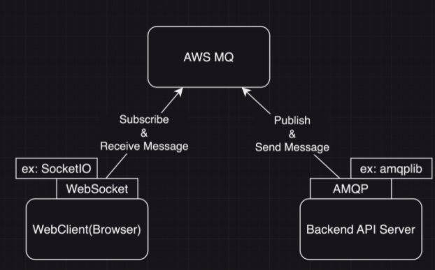

# AWS MQ 예제

## AWS MQ란

- AWS MQ는 Amazon Web Services에서 제공하는 메시지 큐 브로커 서비스입니다.
- AWS MQ는 RabbitMQ, ActiveMQ 등의 메시지 큐 엔진을 사용할 수 있습니다.
- AWS MQ는 다른 AWS 서비스와 통합되어 사용할 수 있습니다.
- AWS MQ는 메시지 큐를 사용하여 분산 시스템의 통합을 단순화 할 수 있습니다.
- AWS MQ는 AMQP, STOMP, MQTT 및 HTTPS 프로토콜을 지원합니다.

## AWS MQ 구성

  

- 서버에서 메세지를 Publish하고, 클라이언트는 Subscribe하는 구조로 구성한다.
- 서버에서 메세지를 publish하려면 AMQP라는 프로토콜을 사용해야 하는데, amqplib라는 라이브러리를 사용하면 간편하게 연결해서 메세지를 publish할 수 있다.
- 클라이언트에서 메세지를 subscribe할때는 amqplib가 필요하지 않다. WebSocket을 사용해서 AWS MQ를 Subscribe할 수 있다. SocketIO를 사용하면 편하게 구현할 수 있다.

## 환경변수

```shell
QUEUE_NAME='QUEUE_EXAMPLE'
AWS_MQ_ENDPOINT='amqps://<username>:<password>@<broker-url>'
```
