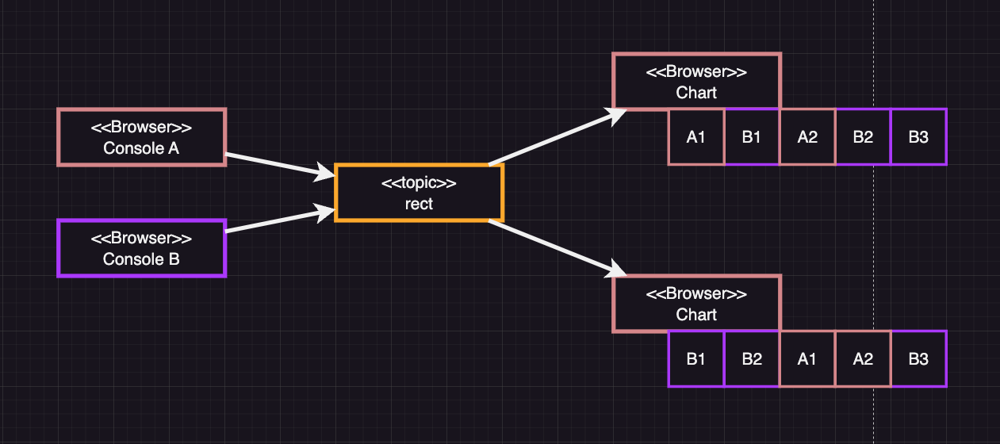

# Message Queue를 사용한 Pub/Sub모델 활용 예제

## 애플리케이션 구성

  

https://user-images.githubusercontent.com/41663269/228703865-76b8c4de-b5e6-4be4-9ba4-12c2c01ded9a.mov  

https://user-images.githubusercontent.com/41663269/228703885-1bed93db-a86d-453e-8bd7-330b97124383.mov  

  

- [애플리케이션 링크](https://aws-mq-test-next-app.vercel.app/console)
- `Console`페이지를 통해 메세지를 publish합니다.
- 사각형 회전 예제는 `rect`, 차트 예제는 `chart` `토픽`을 subscribe합니다.
- 해당하는 토픽에 메세지가 publish되면, 화면을 업데이트합니다.
- 메세지를 publish하고 subscribe하기 위해 websocket을 사용합니다.

## AWS MQ

### AWS MQ란

- AWS MQ는 Amazon Web Services에서 제공하는 메시지 큐 브로커 서비스입니다.
- AWS MQ는 RabbitMQ, ActiveMQ 등의 메시지 큐 엔진을 사용할 수 있습니다.
- AWS MQ는 다른 AWS 서비스와 통합되어 사용할 수 있습니다.
- AWS MQ는 메시지 큐를 사용하여 분산 시스템의 통합을 단순화 할 수 있습니다.
- AWS MQ는 AMQP, STOMP, MQTT 및 HTTPS 프로토콜을 지원합니다.

 

## ActiveMQ

### ActiveMQ란

- ActiveMQ는 Apache Software Foundation에서 개발한 오픈 소스 메시지 브로커로, Java Message Service (JMS)를 구현합니다. - 메시지 브로커는 프로듀서(생산자)와 컨슈머(소비자) 사이에서 비동기 메시지 전달을 처리하는 중간 레이어로 작동합니다. 
- ActiveMQ에서는 주로 두 가지 메시지 전달 모델이 사용되는데, 그 중 하나는 토픽(Topic)입니다.

### Publish-Subscribe 모델

- 토픽은 Publish-Subscribe (Pub-Sub) 모델을 사용한 메시지 전달 방식입니다. 
- 이 모델에서 프로듀서는 메시지를 토픽에 발행하며, 컨슈머는 관심 있는 토픽을 구독합니다. 
- 토픽에 새 메시지가 발행되면, 구독 중인 모든 컨슈머에게 메시지가 전달됩니다.

### 토픽(Topic)

#### 토픽의 동작 방식

- 프로듀서는 메시지를 생성하고, 해당 메시지를 특정 토픽에 발행합니다.
- 컨슈머는 관심 있는 토픽을 구독하기 위해 ActiveMQ 브로커에 등록됩니다.
- 토픽에 새로운 메시지가 발행되면, ActiveMQ 브로커는 구독 중인 모든 컨슈머에게 해당 메시지를 전달합니다.
- 컨슈머는 전달된 메시지를 처리하고, 필요에 따라 응답 메시지를 발행할 수 있습니다.

#### 토픽의 구조

- 토픽은 주로 계층적인 이름 공간을 사용하여 구성됩니다. 
- 토픽 이름은 일반적으로 '.'(dot)으로 구분된 문자열로 표현되며, 이를 통해 관련된 토픽들을 그룹화할 수 있습니다. 
- 예를 들어, "finance.stock.market"이라는 토픽 이름은 금융, 주식, 시장 세 가지 계층으로 구성된 토픽을 나타냅니다.
ActiveMQ 토픽은 발행/구독 패턴을 사용하여 여러 구독자가 동시에 메시지를 수신할 수 있는 방식을 제공하며, 서로 다른 애플리케이션 및 서비스 간의 비동기식 통신을 지원합니다.

#### 토픽의 순서보장

- 같은 producer가 전송한 메시지의 순서는 보장되지만, 서로 다른 producer가 전송한 메시지의 순서는 보장되지 않습니다.  
    
- 이 경우 Total Ordering이라는 기능을 사용하여 순서를 보장할 수 있다고 합니다.  
단, 이 방법은 무거운 동기화 작업이 필요하여 성능이 저하된다고 합니다.
- 또는, 큐와 토픽을 함께 사용하여 순서를 보장하는 방법도 있다고 합니다.
- [참고링크](https://activemq.apache.org/total-ordering)
